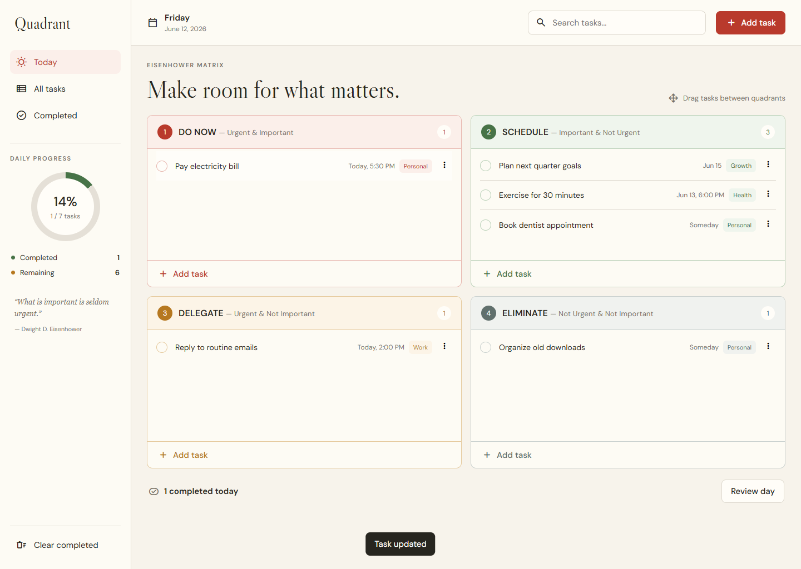
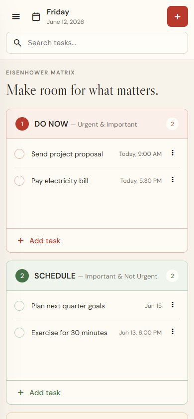

# Quadrant

A calm, personal Eisenhower Matrix task planner for making room for what matters.

## Preview



<p align="center">
  
</p>

## Features

- Four-quadrant task planning
- Drag tasks between quadrants
- Add, edit, complete, search, and delete tasks
- Today, all tasks, and completed views
- Browser-local persistence
- Responsive desktop and mobile layout

## Run locally

Open `index.html` directly, or serve the folder:

```powershell
npx serve .
```

## Privacy

Quadrant has no backend. Tasks remain in your browser's local storage.
